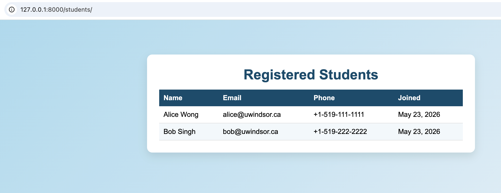
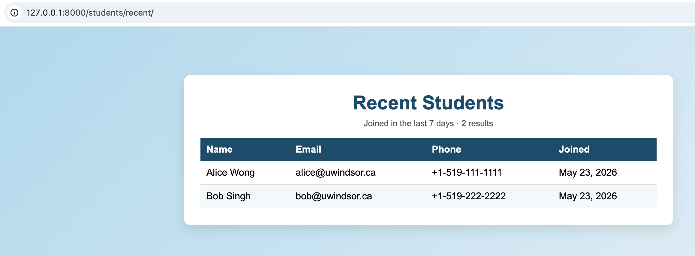
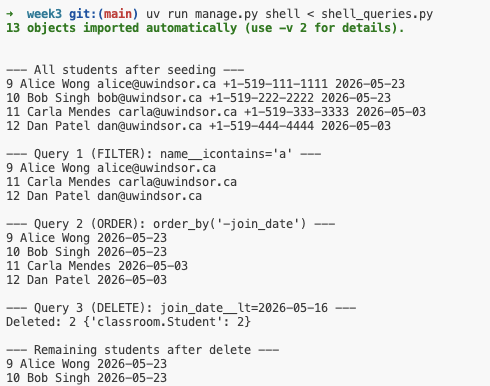

# Week 3: Class Activity (21.05) — Report

**Student Number:** 110195911
**Student:** Lei Jiang
**Date:** 2026-05-23

---

## Task 1 — Add `phone_number` field to the `Student` model

### Source code

**`classroom/models.py`**

```python
from django.db import models

class Student(models.Model):
    name = models.CharField(max_length=100)
    email = models.EmailField(unique=True)
    phone_number = models.CharField(max_length=20, blank=True, default="")
    join_date = models.DateField(auto_now_add=True)

    def __str__(self):
        return self.name
```

### Migration generated

```
$ python manage.py makemigrations classroom
Migrations for 'classroom':
  classroom/migrations/0002_student_phone_number.py
    + Add field phone_number to student

$ python manage.py migrate
Running migrations:
  Applying classroom.0002_student_phone_number... OK
```

### Result in the browser

`http://127.0.0.1:8000/students/` — the table now has a **Phone** column.



---

## Task 2 — Create `/students/recent/` page (last 7 days)

### Source code

**`classroom/views.py`**

```python
from datetime import timedelta

from django.shortcuts import render
from django.utils import timezone

from .models import Student


def recent_students(request):
    days = 7
    cutoff = timezone.now().date() - timedelta(days=days)
    qs = Student.objects.filter(join_date__gte=cutoff).order_by("-join_date")
    return render(request, "classroom/recent_students.html", {
        "students": qs,
        "days": days,
        "count": qs.count(),
        "is_empty": not qs.exists(),
    })
```

**`config/urls.py`** (new route)

```python
from classroom.views import student_list, recent_students

urlpatterns += [path("students/recent/", recent_students, name="student-recent")]
```

**`classroom/templates/classroom/recent_students.html`** (excerpt)

```django
<h1>Recent Students</h1>
<p class="sub">Joined in the last {{ days }} day{{ days|pluralize }} · {{ count }} result{{ count|pluralize }}</p>
<table>
  <thead><tr><th>Name</th><th>Email</th><th>Phone</th><th>Joined</th></tr></thead>
  <tbody>
    
      <tr>
        <td>{{ s.name }}</td>
        <td>{{ s.email }}</td>
        <td>{{ s.phone_number|default:"—" }}</td>
        <td>{{ s.join_date|date:"M d, Y" }}</td>
      </tr>
    
      <tr><td colspan="4" class="empty">No students joined in the last {{ days }} days.</td></tr>
    
  </tbody>
</table>
```

### Result in the browser

`http://127.0.0.1:8000/students/recent/` — shows only students whose `join_date` is within the last 7 days.



> **Note.** The recent page lists the same two rows as `/students/` because Query 3 (DELETE)
> in Task 3 removed the two backdated students (Carla, Dan, joined 2026-05-03). The two
> remaining students (Alice, Bob) were created today, so they fall inside both queries.
> This is the expected outcome and demonstrates that the DELETE query actually ran.

---

## Task 3 — Three shell queries (filter, order, delete)

### Source code — `shell_queries.py`

```python
from datetime import timedelta
from django.utils import timezone
from classroom.models import Student

# Seed data
Student.objects.all().delete()
s1 = Student.objects.create(name="Alice Wong",   email="alice@uwindsor.ca",  phone_number="+1-519-111-1111")
s2 = Student.objects.create(name="Bob Singh",    email="bob@uwindsor.ca",    phone_number="+1-519-222-2222")
s3 = Student.objects.create(name="Carla Mendes", email="carla@uwindsor.ca",  phone_number="+1-519-333-3333")
s4 = Student.objects.create(name="Dan Patel",    email="dan@uwindsor.ca",    phone_number="+1-519-444-4444")

# Backdate two students so the recent-7-days filter has something to exclude
old = timezone.now().date() - timedelta(days=20)
Student.objects.filter(pk__in=[s3.pk, s4.pk]).update(join_date=old)

# Query 1 — FILTER
qs_filter = Student.objects.filter(name__icontains="a")

# Query 2 — ORDER
qs_order = Student.objects.order_by("-join_date")

# Query 3 — DELETE
cutoff = timezone.now().date() - timedelta(days=7)
deleted, info = Student.objects.filter(join_date__lt=cutoff).delete()
```

### How to run

```bash
uv run manage.py shell < shell_queries.py
```

### Result (shell output)

```
--- All students after seeding ---
9  Alice Wong   alice@uwindsor.ca   +1-519-111-1111   2026-05-23
10 Bob Singh    bob@uwindsor.ca     +1-519-222-2222   2026-05-23
11 Carla Mendes carla@uwindsor.ca   +1-519-333-3333   2026-05-03
12 Dan Patel    dan@uwindsor.ca     +1-519-444-4444   2026-05-03

--- Query 1 (FILTER): name__icontains='a' ---
9  Alice Wong   alice@uwindsor.ca
11 Carla Mendes carla@uwindsor.ca
12 Dan Patel    dan@uwindsor.ca

--- Query 2 (ORDER): order_by('-join_date') ---
9  Alice Wong   2026-05-23
10 Bob Singh    2026-05-23
11 Carla Mendes 2026-05-03
12 Dan Patel    2026-05-03

--- Query 3 (DELETE): join_date__lt=2026-05-16 ---
Deleted: 2 {'classroom.Student': 2}

--- Remaining students after delete ---
9  Alice Wong  2026-05-23
10 Bob Singh   2026-05-23
```



---

## How to reproduce

```bash
cd code/week3
uv venv
uv pip install django
uv run manage.py migrate
uv run manage.py shell < shell_queries.py        # seed + run the three queries
uv run manage.py runserver
# open http://127.0.0.1:8000/students/
# open http://127.0.0.1:8000/students/recent/
```
