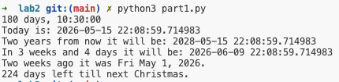
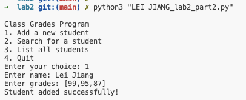
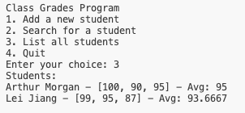
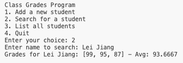
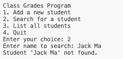
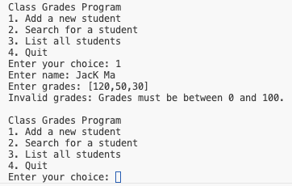
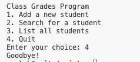
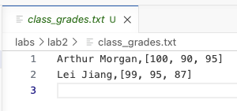
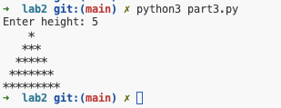

# Lab #2 Report

**Course:** COMP 8347 — Internet Applications and Distributed Systems (Summer 2026)
**Name:** LEI JIANG

---

## Part 1 — Working with date and time types in Python

### Code

```python
from datetime import datetime, timedelta, date


def main():
    # 1. Basic timedelta
    td = timedelta(days=180, hours=10, minutes=30)
    print(td)

    # 2. Today's date and current time
    now = datetime.now()
    print(f"Today is: {now}")

    # 3. Two years from now
    two_years = now.replace(year=now.year + 2)
    print(f"Two years from now it will be: {two_years}")

    # 4. timedelta with weeks and days
    delta = timedelta(weeks=3, days=4)
    future = now + delta
    print(f"In 3 weeks and 4 days it will be: {future}")

    # 5. Two weeks ago as a string
    two_weeks_ago = now - timedelta(weeks=2)
    print(f"Two weeks ago it was {two_weeks_ago.strftime('%a %b %-d, %Y')}.")

    # 6. Days till next Christmas
    today = date.today()
    christmas = date(today.year, 12, 25)
    if today > christmas:
        christmas = date(today.year + 1, 12, 25)
    days_left = (christmas - today).days
    print(f"{days_left} days left till next Christmas.")


if __name__ == "__main__":
    main()
```

### Output

```
180 days, 10:30:00
Today is: 2026-05-15 21:36:59.453479
Two years from now it will be: 2028-05-15 21:36:59.453479
In 3 weeks and 4 days it will be: 2026-06-09 21:36:59.453479
Two weeks ago it was Fri May 1, 2026.
224 days left till next Christmas.
```

> 

---

## Part 2 — Class Grades Program

### Code

```python
import os

FILENAME = "class_grades.txt"


def load_grades():
    grades = {}
    if not os.path.exists(FILENAME):
        return grades
    with open(FILENAME, "r") as f:
        for line in f:
            line = line.strip()
            if not line:
                continue
            name, raw = line.split(",", 1)
            raw = raw.strip().strip("[]")
            scores = [int(s.strip()) for s in raw.split(",") if s.strip()]
            grades[name.strip()] = scores
    return grades


def save_grades(grades):
    with open(FILENAME, "w") as f:
        for name, scores in grades.items():
            f.write(f"{name},{scores}\n")


def parse_grades_input(raw):
    raw = raw.strip().strip("[]")
    scores = [int(s.strip()) for s in raw.split(",") if s.strip()]
    for s in scores:
        if s < 0 or s > 100:
            raise ValueError("Grades must be between 0 and 100.")
    return scores


def add_student(grades):
    name = input("Enter name: ").strip()
    if not name:
        print("Name cannot be empty.")
        return
    try:
        scores = parse_grades_input(input("Enter grades: "))
    except ValueError as e:
        print(f"Invalid grades: {e}")
        return
    grades[name] = scores
    save_grades(grades)
    print("Student added successfully!")


def search_student(grades):
    name = input("Enter name to search: ").strip()
    if name not in grades:
        print(f"Student '{name}' not found.")
        return
    scores = grades[name]
    avg = sum(scores) / len(scores) if scores else 0
    print(f"Grades for {name}: {scores} - Avg: {avg:g}")


def list_students(grades):
    if not grades:
        print("No students.")
        return
    print("Students:")
    for name, scores in grades.items():
        avg = sum(scores) / len(scores) if scores else 0
        print(f"{name} - {scores} - Avg: {avg:g}")


def main():
    grades = load_grades()
    while True:
        print("\nClass Grades Program")
        print("1. Add a new student")
        print("2. Search for a student")
        print("3. List all students")
        print("4. Quit")
        choice = input("Enter your choice: ").strip()
        if choice == "1":
            add_student(grades)
        elif choice == "2":
            search_student(grades)
        elif choice == "3":
            list_students(grades)
        elif choice == "4":
            print("Goodbye!")
            break
        else:
            print("Invalid choice.")


if __name__ == "__main__":
    main()
```

### Screenshots — Feature Demonstration

**1) Add a new student**

> 

**2) List all students**

> 

**3) Search for a student**

> 

**4) Error handling — student not found**

> 

**5) Error handling — invalid grades (out of 0–100)**

> 

**6) Quit**

> 

**7) class_grades.txt file content after operations**

> 

---

## Part 3 — Pyramid of Stars

### Code

```python
def main():
    try:
        height = int(input("Enter height: "))
    except ValueError:
        print("Height must be an integer.")
        return
    if height <= 0:
        print("Height must be positive.")
        return
    for i in range(1, height + 1):
        for _ in range(height - i):
            print(" ", end="")
        for _ in range(2 * i - 1):
            print("*", end="")
        print()


if __name__ == "__main__":
    main()
```

### Output (height = 5)

```
Enter height: 5
    *
   ***
  *****
 *******
*********
```

> 
